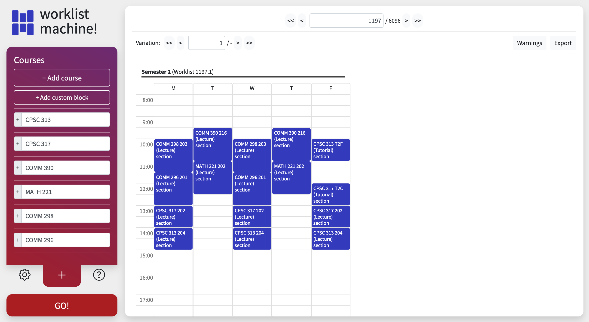

# worklist machine
https://worklist-machine.web.app

A labour of love. (my love for making shortcuts that net me a -100x time savings.)

---

## What it does + why
A **worklist** is UBC's word for a "tentative course schedule." It's the list of courses you plan to enrol in, and usually do, unless you're a second year, in which case you pick up the scraps from the other students. Worklist machine is meant to generate and (soon) optimize these schedules according to your preferences.

Why? In short: I had a swiss-cheese schedule in first year. The next year, I found myself spending a lot of time making sure my schedule didn't have gaping holes in it.

## How to use it
Input your courses and preferences on the left; view and navigate outputs on the right. 

There is currently a default input that is easier to figure out than a description here, so go check it out! This input is the list of courses I'm taking in 2021-2022 school year. (just term 2 since I'm still working through term 1.) At the top of the page, enter **1197** to navigate to the worklist I chose.

If you don't know what courses to enter, interesting + massive outputs come with multi-activity courses such as CPSC 110, CPSC 121, CPSC 221. 

If no worklists show up, it's possible the "maximum courses per term" (default 6) setting is incompatible with the courses you've entered. 

###### UI, colours, everything subject to change. Logo not subject to change i'm very proud of it

## How it works

### Data
Data is from [Liang and Adrian's UBC courses API](https://docs.ubccourses.com/) and stored in my own database (MongoDB Atlas free tier, $0). I do plan to write my own data scraper though (or fork theirs), since their schema isn't really conducive to comparing overlapping course times.

### Backend
A simple Node and Express server hosted for $0 on repl.it

### Frontend
Written with React and Javascript– Typescript might have been a better choice here. Also a lot of Bootstrap (that I added when I didn't know how to use computers) which I'd like to get rid of. Hosted for $0 using Firebase Hosting. 

### Schedule generation
see [scheduling engine](./client/src/scheduling-engine.js)

1. **Completion pathways -** Figure out all ways of completing a course, for each course.
    - It's assumed you don't need to register for anything in two separate time periods.
    - A course has multiple `section`s (smallest thing you register in). Each section has an `activity` (e.g. lecture, lab, tutorial) which classifies the section, and because of this, you may need to register in multiple sections to achieve credit for a course. Each thing you need to register in is called a `requirement`, and any one of its embedded sections can fill it.
    - A completion pathway for COURSE 101 with two requirements may be `[{ term: 1, activity: 'Lecture', sections: [...] }, { term: 1, activity: 'Laboratory', sections: [...] }]`
    - An alternate pathway: `[{ term: 2, activity: 'Web-Oriented Course', sections: [...] }, { term: 2, activity: 'Laboratory', sections: [...] }]`
    - On the high end, a course will have 3-4 of these. 1-2 is normal. 0 will probably cause some sort of error LOL.
2. **Arrangements -** Figure out all ways of completing ALL courses
    - Get all combinations of completion pathways that are valid. i.e, don't overload a term with 20 sections.
    - An `arrangement` will be the flattened list of requirements from each completion pathway used.
    - End goal: one arrangement is a "sampling platter" of sections, or a list of requirements, from which many schedules can be generated.
    - `(completion pathways of course 1) * (of 2)  * ... * (of n)` arrangements
3. **Worklists -** Figure out all valid worklists given the requirements in an arrangement, for each arrangement
    - Toss out any worklists with overlapping sections
    - Theoretical worst output of one arrangemnt = `(sections of requirement 1) * (of 2) * ... * (of n)`.
4. **(todo) Variations -** Solve each arrangement until last requirement (or two) and deem the different sections of the final requirement "variations" of the worklist so far.
    - Lets the user move through the results in two dimensions. Realistically, when clicking through the list of results, this means you don't have to watch some 20-section lab dance around the timetable 20 times before any other sections move. Get the next worklist if the current one sucks, then you can adjust the lab if the worklist is otherwise good.
0. **Testing for overlap -** it's like I dumped all my @typedefs here already, why not continue. 
    - Schedules are represented using `DayBlockSet`s, probably multiple (one for each term). This data structure looks something like: `{ term: 1, mon: [...], wed: [...], fri: [...] }` where each list is a list of `block`s. 
      - Is the dayblockset actually faster than just an array? I don't know. 
    - If any one requirement of an arrangement cannot be fulfilled, i.e. all requirement.sections overlap with all worklists generated so far, the arrangement shouldn't appear in the results.

## todo

### things that automatically get priority because there's a not-working UI element for them:
- Most things in the settings panel. Only "max courses per term" has any effect on output for now.
- adding custom blocks (e.g. walk the dog every day 8 - 830, don't schedule classes here)
- "warnings" button in the top-right 
  - if there's a lot of physical distance between back-to-back classes
  - if a course in the given worklist is full or blocked
- "export" button in the top right
  - Likely just a pile of links to all the courses in the current worklist
- Show when there's a section without any presence on the timetable. "unscheduled courses"

### future
- keyboard for view navigation
- my own course scraper
- "or" input groups (e.g. I want to take cpsc 313 or 317 this year)
- various warnings for inputs that are sure to freeze a browser. Maybe a progress indicator? solve the halting problem bro
- other schools? 😳  It's something I planned for all along, although the scheduling algorithm would need tweaking. As a result of this, I may also need to pay more than $0 to run the app. We'll see!